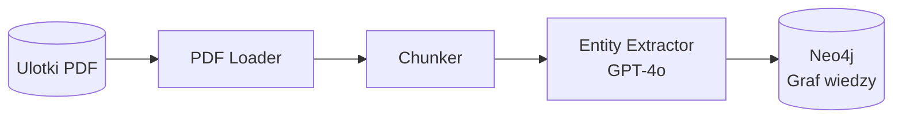
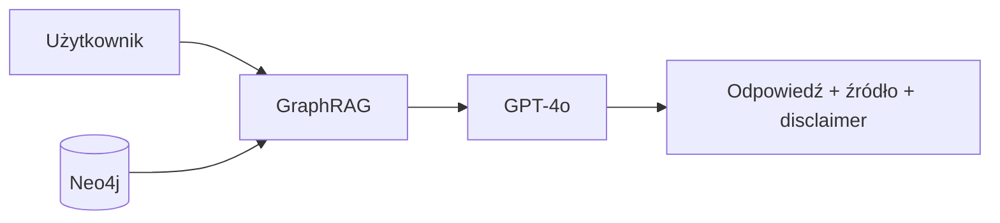
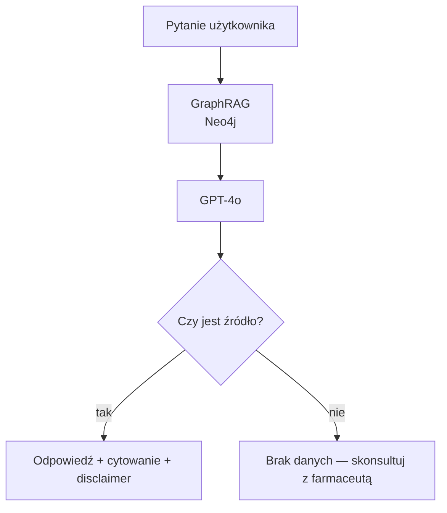

# 1. Przegląd projektu (Overview)

**MedGraph AI** to interfejs języka naturalnego do wyszukiwania informacji o lekach na podstawie ulotek w formacie PDF. Użytkownik zadaje pytanie (np. "Czy ibuprofen i warfaryna mogą być stosowane razem?"), a system przeszukuje zaindeksowane dokumenty i zwraca odpowiedź wraz ze wskazaniem źródła.

System obsługuje zarówno proste pytania (wskazania, dawkowanie), jak i złożone zapytania wymagające połączenia kilku faktów — np. lek + interakcja + przeciwwskazanie. Wyszukiwanie odbywa się przez **graf wiedzy (GraphRAG)** zbudowany na Neo4j, który reprezentuje encje i relacje farmaceutyczne wyekstrahowane z ulotek. Projekt wykorzystuje publicznie dostępne ulotki leków jako dane źródłowe. Technologie: Python, OpenAI API, LangChain, Neo4j.

---

# 2. Opis problemu (Problem Statement)

## Problem

Informacje o lekach są zapisane w długich dokumentach PDF (ulotki, charakterystyki produktu). Wyszukanie odpowiedzi na konkretne pytanie wymaga ręcznego przeglądania wielu stron. Tradycyjny RAG radzi sobie z prostymi pytaniami, ale zawodzi gdy odpowiedź wymaga połączenia kilku faktów z różnych miejsc dokumentu — np. dawka + wiek pacjenta + choroba towarzysząca.

## Rozwiązanie

System buduje graf wiedzy z ulotek PDF, gdzie węzły to leki, substancje, wskazania i przeciwwskazania, a krawędzie to relacje między nimi (np. `INTERACTS_WITH`, `CONTRAINDICATED_IN`). Dzięki temu złożone pytania są rozwiązywane przez przejście po grafie, a nie przez wyszukiwanie fragmentów tekstu. Każda odpowiedź zawiera informację o źródle i disclaimer że decyzję podejmuje lekarz/farmaceuta.

---

# 3. Architektura systemu (System Architecture)

**Faza 1 — wczytywanie dokumentów (jednorazowa):**

**Faza 2 — odpowiadanie na pytania:**

## Komponenty systemu

| Komponent | Opis | Technologia |
|---|---|---|
| PDF Loader | Wczytywanie ulotek | LangChain PyPDFLoader |
| Chunker | Podział tekstu na fragmenty | RecursiveCharacterTextSplitter |
| Entity Extractor | Ekstrakcja encji i relacji z tekstu | GPT-4o |
| Graf wiedzy | Encje i relacje farmaceutyczne | Neo4j |
| GraphRAG | Wyszukiwanie przez graf | LangChain + Neo4j |
| Interfejs | Interfejs użytkownika | Streamlit lub CLI |

---

# 4. Projekt systemu AI (AI System Design)

## LLM

- **Model**: GPT-4o przez OpenAI API
- **Zastosowanie**: ekstrakcja encji z ulotek, odpowiadanie na pytania na podstawie pobranego kontekstu

## Graf wiedzy

- **Baza**: Neo4j (lokalnie)
- **Węzły**: Lek, Substancja czynna, Wskazanie, Przeciwwskazanie, Działanie niepożądane, Dawka, Grupa pacjentów
- **Relacje**: `ZAWIERA`, `WSKAZANY_DLA`, `PRZECIWWSKAZANY_W`, `INTERAGUJE_Z`, `ALTERNATYWA_DLA`

> _Wczesna wizualizacja struktury grafu — wersja poglądowa, może ulec zmianie._

## Workflow systemu

> _Wczesna wizualizacja przepływu — wersja poglądowa, może ulec zmianie._

---

# 5. Źródła danych (Data Sources)

| Źródło | Format | Cel | Przetwarzanie |
|---|---|---|---|
| Ulotki dla pacjenta (PIL) | PDF | Dawkowanie, przeciwwskazania, działania niepożądane | Chunking + ekstrakcja encji i relacji → Neo4j |
| Charakterystyki produktu (SmPC) | PDF | Szczegółowe dane kliniczne | Chunking + ekstrakcja encji i relacji → Neo4j |

Każdy dokument ma zapisane metadane: nazwa leku, typ dokumentu, numer strony — żeby można było cytować źródło w odpowiedzi.

---

# 6. User Stories

**US-01: Zapytanie o dawkowanie**
Jako użytkownik
Chcę zapytać o dawkę leku dla dziecka o podanym wieku i wadze
Aby uzyskać informację bez ręcznego przeszukiwania ulotki

Acceptance Criteria:
- system zwraca dawkę z podaniem dokumentu źródłowego i strony
- odpowiedź zawiera disclaimer o konieczności konsultacji z lekarzem
- system sugeruje konsultację z lekarzem przed rozpoczęciem terapii

---

**US-02: Sprawdzenie interakcji**
Jako użytkownik
Chcę sprawdzić czy dwa leki można stosować jednocześnie
Aby uniknąć niebezpiecznych interakcji

Acceptance Criteria:
- system sprawdza relację między lekami w grafie wiedzy
- jeśli interakcja istnieje — opisuje ryzyko i podaje źródło
- jeśli brak danych — informuje o tym wprost
- system sugeruje konsultację z lekarzem przed rozpoczęciem terapii

---

**US-03: Leki przeciwwskazane w ciąży**
Jako użytkownik
Chcę uzyskać listę leków przeciwwskazanych w ciąży
Aby szybko sprawdzić bezpieczeństwo stosowanych leków

Acceptance Criteria:
- system zwraca listę leków z zaindeksowanych dokumentów
- każda pozycja ma cytowanie
- odpowiedź zaznacza, że lista dotyczy tylko zaindeksowanych dokumentów
- system sugeruje konsultację z lekarzem przed rozpoczęciem terapii

---

**US-04: Wyszukanie zamiennika**
Jako użytkownik
Chcę znaleźć alternatywę dla danego leku z tym samym składnikiem aktywnym
Aby móc zapytać lekarza o zamiennik

Acceptance Criteria:
- system zwraca leki z relacją ALTERNATYWA_DLA lub tym samym składnikiem aktywnym
- odpowiedź informuje że zamiana wymaga konsultacji
- system sugeruje konsultację z lekarzem przed rozpoczęciem terapii

---

**US-05: Ostrzeżenia dla grup ryzyka**
Jako użytkownik
Chcę uzyskać informacje o ostrzeżeniach dotyczących danego leku dla konkretnej grupy pacjentów (np. osoby starsze, dzieci, pacjenci z niewydolnością nerek)
Aby ocenić czy lek jest bezpieczny w danym przypadku

Acceptance Criteria:
- system zwraca ostrzeżenia i przeciwwskazania dla wskazanej grupy pacjentów z cytowaniem źródła
- jeśli brak danych dla danej grupy — informuje o tym wprost
- system sugeruje konsultację z lekarzem przed rozpoczęciem terapii

---

**US-06: Brak danych — uczciwa odmowa**
Jako użytkownik
Chcę żeby system powiedział wprost, gdy nie ma danych o danym leku
Aby nie polegać na wymyślonej odpowiedzi

Acceptance Criteria:
- system nie generuje odpowiedzi z "pamięci" modelu gdy brak danych w dokumentach
- komunikat jest jednoznaczny i sugeruje konsultację ze specjalistą

---

# 7. Scenariusze użycia (Use Cases)

**UC-01: Dawkowanie pediatryczne**

Aktor: Użytkownik (rodzic lub farmaceuta)

Opis: Użytkownik pyta o dawkę ibuprofenu dla 8-letniego dziecka ważącego 30 kg.

Kroki:
1. Użytkownik wpisuje pytanie: "Jaka jest dawka ibuprofenu dla dziecka 8 lat, 30 kg?"
2. GraphRAG pobiera regułę dawkowania z grafu (węzły: Lek, Dawka, Grupa pacjentów)
3. LLM generuje odpowiedź z dawką, cytowaniem, disclaimerem i sugestią konsultacji z lekarzem

---

**UC-02: Sprawdzenie interakcji**

Aktor: Użytkownik (pacjent lub lekarz)

Opis: Użytkownik pyta czy warfarynę można stosować z aspiryną.

Kroki:
1. Użytkownik wpisuje: "Czy warfaryna i aspiryna mogą być stosowane razem?"
2. GraphRAG sprawdza krawędź INTERAGUJE_Z między oboma lekami w Neo4j
3. LLM odpowiada z opisem ryzyka, cytowaniem źródła i sugestią konsultacji z lekarzem

---

**UC-03: Zamiennik leku**

Aktor: Użytkownik (pacjent)

Opis: Użytkownik pyta o zamiennik diklofenaku.

Kroki:
1. Użytkownik wpisuje: "Czym można zastąpić diklofenak?"
2. GraphRAG szuka leków z relacją ALTERNATYWA_DLA lub tym samym składnikiem aktywnym
3. System zwraca listę z cytowaniami i sugestią konsultacji z lekarzem przed zmianą terapii

---

**UC-04: Pytanie o nieznany lek**

Aktor: Użytkownik

Opis: Użytkownik pyta o lek, którego nie ma w zaindeksowanych dokumentach.

Kroki:
1. Użytkownik wpisuje pytanie o lek spoza kolekcji
2. System nie znajduje danych w Neo4j
3. System odpowiada: "Brak danych w dostępnych dokumentach. Skonsultuj się z lekarzem lub farmaceutą."

---

**UC-05: Ostrzeżenia dla grupy ryzyka**

Aktor: Użytkownik (pacjent lub opiekun)

Opis: Użytkownik pyta o ostrzeżenia dotyczące stosowania leku u osoby starszej z niewydolnością nerek.

Kroki:
1. Użytkownik wpisuje: "Jakie ostrzeżenia dotyczą stosowania metforminy u osób starszych z niewydolnością nerek?"
2. GraphRAG przeszukuje węzły Przeciwwskazanie i Grupa pacjentów powiązane z danym lekiem
3. LLM generuje odpowiedź z listą ostrzeżeń, cytowaniem źródła i sugestią konsultacji z lekarzem

---

# 8. Scenariusze ewaluacji (Evaluation Scenarios)

Sekcja definiuje w jaki sposób system będzie testowany i oceniany. Każdy scenariusz zawiera konkretne zadanie testowe, oczekiwane zachowanie systemu oraz kryteria sukcesu.

---

**E-01: Pytanie o wskazania**

Wejście: "Na co stosuje się ibuprofen?"

Oczekiwane zachowanie:
- GraphRAG wyszukuje węzły Wskazanie powiązane z lekiem w Neo4j
- system generuje odpowiedź opartą na danych z grafu
- odpowiedź zawiera cytowanie dokumentu źródłowego i sugestię konsultacji z lekarzem

Kryterium sukcesu: odpowiedź jest zgodna z ulotką, zawiera cytowanie i disclaimer

---

**E-02: Interakcja lek-lek**

Wejście: "Czy warfaryna i aspiryna mogą być stosowane razem?"

Oczekiwane zachowanie:
- GraphRAG identyfikuje krawędź INTERAGUJE_Z między oboma lekami w Neo4j
- system opisuje ryzyko interakcji z cytowaniem źródła
- odpowiedź zawiera sugestię konsultacji z lekarzem przed rozpoczęciem terapii

Kryterium sukcesu: odpowiedź poprawnie identyfikuje interakcję, podaje źródło i nie zawiera informacji spoza dokumentów

---

**E-03: Dawkowanie z uwzględnieniem parametrów pacjenta**

Wejście: "Jaka jest dawka ibuprofenu dla dziecka w wieku 8 lat i wadze 30 kg?"

Oczekiwane zachowanie:
- GraphRAG przechodzi po węzłach Lek → Dawka → Grupa pacjentów w Neo4j
- system zwraca dawkę dopasowaną do podanych parametrów
- odpowiedź zawiera cytowanie i sugestię konsultacji z lekarzem przed podaniem leku dziecku

Kryterium sukcesu: zwrócona dawka jest zgodna z ulotką, odpowiedź zawiera cytowanie i disclaimer

---

**E-04: Pytanie wieloetapowe (multi-hop)**

Wejście: "Które leki przeciwbólowe są bezpieczne dla pacjenta z chorobą wrzodową żołądka?"

Oczekiwane zachowanie:
- GraphRAG łączy węzły Wskazanie (ból) z węzłami Działanie niepożądane (żołądek) i Przeciwwskazanie
- system dzieli leki na bezpieczne i niezalecane z uzasadnieniem
- odpowiedź zawiera cytowania i sugestię konsultacji z lekarzem

Kryterium sukcesu: odpowiedź zawiera obie kategorie leków z uzasadnieniem opartym na danych z grafu

---

**E-05: Wyszukanie zamiennika**

Wejście: "Czym można zastąpić diklofenak?"

Oczekiwane zachowanie:
- GraphRAG wyszukuje węzły powiązane relacją ALTERNATYWA_DLA lub tą samą substancją czynną
- system zwraca listę alternatyw z cytowaniami
- odpowiedź informuje że zamiana wymaga konsultacji z lekarzem przed rozpoczęciem terapii

Kryterium sukcesu: lista zawiera co najmniej jeden zamiennik z cytowaniem i disclaimerem

---

**E-06: Ostrzeżenia dla grupy ryzyka**

Wejście: "Jakie ostrzeżenia dotyczą stosowania metforminy u osób starszych z niewydolnością nerek?"

Oczekiwane zachowanie:
- GraphRAG przeszukuje węzły Przeciwwskazanie i Grupa pacjentów powiązane z lekiem
- system zwraca listę ostrzeżeń właściwych dla wskazanej grupy
- odpowiedź zawiera cytowania i sugestię konsultacji z lekarzem

Kryterium sukcesu: odpowiedź zawiera co najmniej jedno ostrzeżenie z cytowaniem; zaznacza że dane dotyczą tylko zaindeksowanych dokumentów

---

**E-07: Brak danych w kolekcji**

Wejście: pytanie o lek nieobecny w zaindeksowanych dokumentach

Oczekiwane zachowanie:
- system nie znajduje danych w Neo4j
- system nie generuje odpowiedzi z pamięci modelu
- system zwraca jednoznaczny komunikat o braku danych i sugeruje konsultację z lekarzem lub farmaceutą

Kryterium sukcesu: odpowiedź nie zawiera żadnych wymyślonych informacji; komunikat jest jednoznaczny

---

# 9. Ograniczenia systemu (Limitations)

**Jakość ekstrakcji encji**
LLM może niepoprawnie wyekstrahować encje lub relacje z PDF — szczególnie z tabel i list. Wpływ: niekompletny lub błędny graf, gorsza jakość odpowiedzi GraphRAG.

**Halucynacje LLM**
Model może wyjść poza kontekst i dodać informacje spoza dokumentów. Mitygacja: prompt instruuje model żeby odpowiadał tylko na podstawie dostarczonego kontekstu.

**Niepełna kolekcja dokumentów**
System zna tylko zaindeksowane ulotki. Pytania o leki spoza kolekcji zawsze kończą się odmową. Jest to świadome ograniczenie — projekt nie zastępuje pełnej bazy leków.

**Jakość skanowanych PDF**
Słabej jakości skany mogą dać błędny tekst. W takich przypadkach wyniki są nieprzewidywalne.

---

# 10. Plan demonstracji (Demo Plan)

## Przygotowanie

1. Ustaw klucz `OPENAI_API_KEY` w pliku `.env`
2. Uruchom Neo4j lokalnie (`docker run -p 7474:7474 -p 7687:7687 neo4j`)
3. Uruchom ingestion: `python ingest.py` (wczytuje PDF-y, buduje graf w Neo4j)
4. Uruchom aplikację: `streamlit run app.py`

## Przebieg demonstracji

**Krok 1** — pokaż graf wiedzy w Neo4j Browser: węzły leków, substancji czynnych, wskazań, przeciwwskazań i relacje między nimi

**Krok 2** — zadaj proste pytanie o wskazania (np. "Na co stosuje się paracetamol?") — pokaż odpowiedź z cytowaniem i disclaimerem

**Krok 3** — zadaj pytanie o interakcję (np. "Czy warfaryna i aspiryna mogą być stosowane razem?") — pokaż że GraphRAG przechodzi po krawędzi INTERAGUJE_Z w grafie i zwraca odpowiedź z cytowaniem

**Krok 4** — zadaj pytanie wieloetapowe (np. "Który lek przeciwbólowy jest bezpieczny przy chorobie wrzodowej żołądka?") — pokaż że GraphRAG łączy węzły wskazań i działań niepożądanych i zwraca strukturalną odpowiedź

**Krok 5** — zadaj pytanie o ostrzeżenia dla grupy ryzyka (np. "Jakie ostrzeżenia dotyczą metforminy u osób starszych z niewydolnością nerek?") — pokaż odpowiedź z cytowaniem i sugestią konsultacji z lekarzem

**Krok 6** — zapytaj o lek spoza kolekcji — pokaż uczciwy komunikat o braku danych i sugestię konsultacji ze specjalistą
