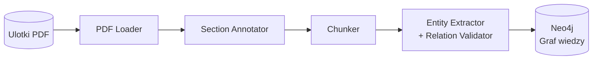
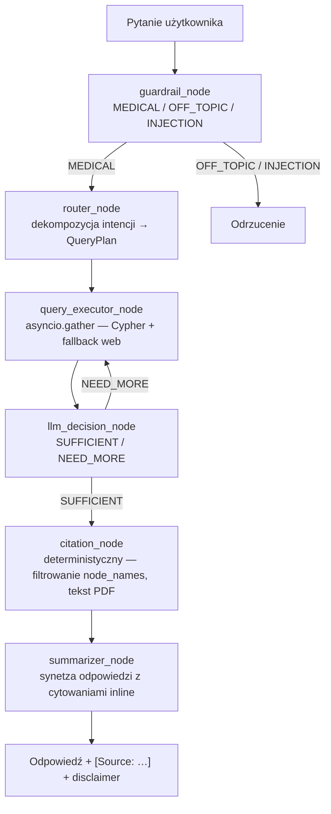
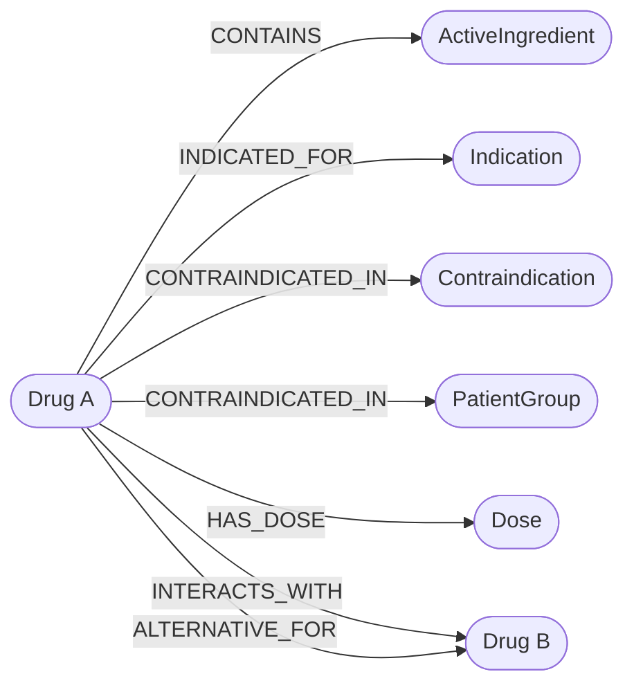
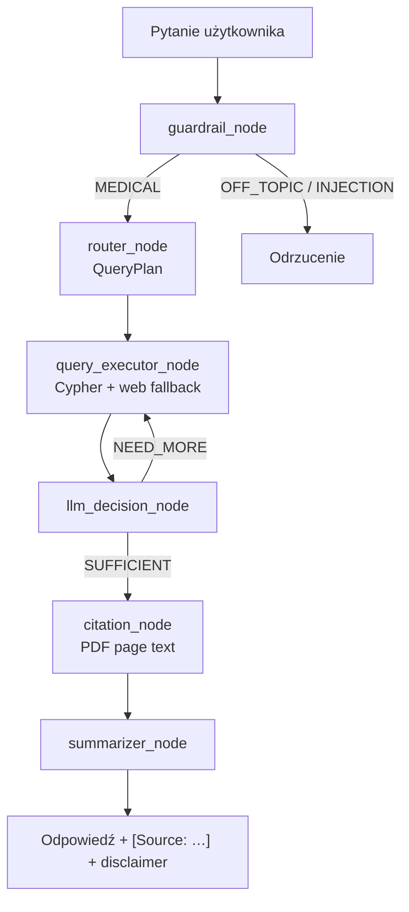

# 1. Przegląd projektu (Overview)

**MedGraph AI** to interfejs języka naturalnego do wyszukiwania informacji o lekach na podstawie ulotek w formacie PDF. Użytkownik zadaje pytanie (np. "Czy ibuprofen i warfaryna mogą być stosowane razem?"), a system przeszukuje zaindeksowane dokumenty i zwraca odpowiedź wraz ze wskazaniem źródła.

System obsługuje zarówno proste pytania (wskazania, dawkowanie), jak i złożone zapytania wymagające połączenia kilku faktów — np. lek + interakcja + przeciwwskazanie. Wyszukiwanie odbywa się przez **graf wiedzy (GraphRAG)** zbudowany na Neo4j, który reprezentuje encje i relacje farmaceutyczne wyekstrahowane z ulotek. Projekt wykorzystuje publicznie dostępne ulotki leków jako dane źródłowe. Technologie: Python, OpenAI API, LangChain, Neo4j.

---

# 2. Opis problemu (Problem Statement)

## Problem

Informacje o lekach są zapisane w długich dokumentach PDF (ulotki, charakterystyki produktu). Wyszukanie odpowiedzi na konkretne pytanie wymaga ręcznego przeglądania wielu stron. Tradycyjny RAG radzi sobie z prostymi pytaniami, ale zawodzi gdy odpowiedź wymaga połączenia kilku faktów z różnych miejsc dokumentu — np. dawka + wiek pacjenta + choroba towarzysząca.

## Rozwiązanie

System buduje graf wiedzy z ulotek PDF, gdzie węzły to leki, substancje, wskazania i przeciwwskazania, a krawędzie to relacje między nimi (np. `INTERACTS_WITH`, `CONTRAINDICATED_IN`). Dzięki temu złożone pytania są rozwiązywane przez przejście po grafie, a nie przez wyszukiwanie fragmentów tekstu. Każda odpowiedź zawiera informację o źródle i disclaimer że decyzję podejmuje lekarz/farmaceuta.

---

# 3. Architektura systemu (System Architecture)

**Faza 1 — wczytywanie dokumentów (jednorazowa):**



**Faza 2 — odpowiadanie na pytania (pipeline wieloagentowy):**



## Komponenty systemu

| Komponent | Opis | Technologia |
|---|---|---|
| PDF Loader | Wczytywanie ulotek; metadane: source_file, page_number, doc_type | LangChain PyPDFLoader |
| Section Annotator | Wykrywa typ sekcji każdej strony i propaguje go do kolejnych stron | regex, earliest-match-by-position |
| Chunker | Podział tekstu na fragmenty z zachowaniem sekcji i metadanych | RecursiveCharacterTextSplitter |
| Entity Extractor | Ekstrakcja encji i relacji z tekstu; walidacja typów relacji | GPT-4o / DeepSeek |
| Graf wiedzy | Encje i relacje farmaceutyczne; ClinicalConcept jako wspólny węzeł bazowy | Neo4j |
| Guardrail | Klasyfikacja wejścia: MEDICAL / OFF_TOPIC / INJECTION | LangGraph node + LLM |
| Router | Dekompozycja pytania na QueryPlan (intencja + encja) z rozwiązywaniem zaimków | LangGraph node + LLM |
| Executor | Równoległe zapytania Cypher; fallback na wyszukiwanie webowe | asyncio.gather, DuckDuckGo |
| Decision | LLM decyduje: kontynuować czy zakończyć zbieranie dowodów | LangGraph node + LLM |
| Citation | Deterministyczna ekstrakcja cytowań z node_names + tekst strony PDF | pypdf, keyword scoring |
| Summarizer | Synteza odpowiedzi z cytowaniami inline [Source: …] | LangGraph node + LLM |
| Interfejs | Interfejs użytkownika z rozwijalną sekcją Sources | Streamlit |

---

# 4. Projekt systemu AI (AI System Design)

## LLM

- **Model**: GPT-4o (OpenAI) lub DeepSeek-chat — konfigurowane przez `LLM_PROVIDER` w `.env`
- **Zastosowanie w ingestion**: ekstrakcja encji i relacji z ulotek (`ENTITY_EXTRACTION_PROMPT`)
- **Zastosowanie w agencie**: guardrail (klasyfikacja), router (dekompozycja intencji), decision (stop/continue), summarizer (synteza odpowiedzi)
- **Citation node jest deterministyczny** — nie używa LLM; filtruje node_names i pobiera tekst ze stron PDF

## Graf wiedzy

- **Baza**: Neo4j (Docker)
- **Węzły**: `Drug`, `ActiveIngredient`, `Indication`, `Contraindication`, `AdverseEffect`, `Dose`, `PatientGroup` (wszystkie kliniczne dziedziczą etykietę `ClinicalConcept`)
- **Relacje**: `CONTAINS`, `INDICATED_FOR`, `CONTRAINDICATED_IN`, `INTERACTS_WITH`, `ALTERNATIVE_FOR`, `HAS_DOSE`, `WARNS_FOR`
- Każda relacja niesie `source_citations` (lista `"plik|strona"`)



## Pipeline agentowy



**Bezpieczeństwo zapytań**: wszystkie szablony Cypher używają parametrów `$entity`/`$secondary_entity` — dane użytkownika nigdy nie są interpolowane do treści zapytania.

---

# 5. Źródła danych (Data Sources)

| Źródło | Format | Cel | Przetwarzanie |
|---|---|---|---|
| Ulotki dla pacjenta (PIL) | PDF | Dawkowanie, przeciwwskazania, działania niepożądane | Chunking + ekstrakcja encji i relacji → Neo4j |
| Charakterystyki produktu (SmPC) | PDF | Szczegółowe dane kliniczne | Chunking + ekstrakcja encji i relacji → Neo4j |

Każdy dokument ma zapisane metadane: nazwa leku, typ dokumentu, numer strony — żeby można było cytować źródło w odpowiedzi.

---

# 6. User Stories

**US-01: Zapytanie o dawkowanie**
Jako użytkownik
Chcę zapytać o dawkę leku dla dziecka o podanym wieku i wadze
Aby uzyskać informację bez ręcznego przeszukiwania ulotki

Acceptance Criteria:
- system zwraca dawkę z podaniem dokumentu źródłowego i strony
- odpowiedź zawiera disclaimer o konieczności konsultacji z lekarzem
- system sugeruje konsultację z lekarzem przed rozpoczęciem terapii

---

**US-02: Sprawdzenie interakcji**
Jako użytkownik
Chcę sprawdzić czy dwa leki można stosować jednocześnie
Aby uniknąć niebezpiecznych interakcji

Acceptance Criteria:
- system sprawdza relację między lekami w grafie wiedzy
- jeśli interakcja istnieje — opisuje ryzyko i podaje źródło
- jeśli brak danych — informuje o tym wprost
- system sugeruje konsultację z lekarzem przed rozpoczęciem terapii

---

**US-03: Leki przeciwwskazane w ciąży**
Jako użytkownik
Chcę uzyskać listę leków przeciwwskazanych w ciąży
Aby szybko sprawdzić bezpieczeństwo stosowanych leków

Acceptance Criteria:
- system zwraca listę leków z zaindeksowanych dokumentów
- każda pozycja ma cytowanie
- odpowiedź zaznacza, że lista dotyczy tylko zaindeksowanych dokumentów
- system sugeruje konsultację z lekarzem przed rozpoczęciem terapii

---

**US-04: Wyszukanie zamiennika**
Jako użytkownik
Chcę znaleźć alternatywę dla danego leku z tym samym składnikiem aktywnym
Aby móc zapytać lekarza o zamiennik

Acceptance Criteria:
- system zwraca leki z relacją ALTERNATYWA_DLA lub tym samym składnikiem aktywnym
- odpowiedź informuje że zamiana wymaga konsultacji
- system sugeruje konsultację z lekarzem przed rozpoczęciem terapii

---

**US-05: Ostrzeżenia dla grup ryzyka**
Jako użytkownik
Chcę uzyskać informacje o ostrzeżeniach dotyczących danego leku dla konkretnej grupy pacjentów (np. osoby starsze, dzieci, pacjenci z niewydolnością nerek)
Aby ocenić czy lek jest bezpieczny w danym przypadku

Acceptance Criteria:
- system zwraca ostrzeżenia i przeciwwskazania dla wskazanej grupy pacjentów z cytowaniem źródła
- jeśli brak danych dla danej grupy — informuje o tym wprost
- system sugeruje konsultację z lekarzem przed rozpoczęciem terapii

---

**US-06: Brak danych — uczciwa odmowa**
Jako użytkownik
Chcę żeby system powiedział wprost, gdy nie ma danych o danym leku
Aby nie polegać na wymyślonej odpowiedzi

Acceptance Criteria:
- system nie generuje odpowiedzi z "pamięci" modelu gdy brak danych w dokumentach
- komunikat jest jednoznaczny i sugeruje konsultację ze specjalistą

---

# 7. Scenariusze użycia (Use Cases)

**UC-01: Dawkowanie pediatryczne**

Aktor: Użytkownik (rodzic lub farmaceuta)

Opis: Użytkownik pyta o dawkę ibuprofenu dla 8-letniego dziecka ważącego 30 kg.

Kroki:
1. Użytkownik wpisuje pytanie: "Jaka jest dawka ibuprofenu dla dziecka 8 lat, 30 kg?"
2. GraphRAG pobiera regułę dawkowania z grafu (węzły: Lek, Dawka, Grupa pacjentów)
3. LLM generuje odpowiedź z dawką, cytowaniem, disclaimerem i sugestią konsultacji z lekarzem

---

**UC-02: Sprawdzenie interakcji**

Aktor: Użytkownik (pacjent lub lekarz)

Opis: Użytkownik pyta czy warfarynę można stosować z aspiryną.

Kroki:
1. Użytkownik wpisuje: "Czy warfaryna i aspiryna mogą być stosowane razem?"
2. GraphRAG sprawdza krawędź INTERAGUJE_Z między oboma lekami w Neo4j
3. LLM odpowiada z opisem ryzyka, cytowaniem źródła i sugestią konsultacji z lekarzem

---

**UC-03: Zamiennik leku**

Aktor: Użytkownik (pacjent)

Opis: Użytkownik pyta o zamiennik diklofenaku.

Kroki:
1. Użytkownik wpisuje: "Czym można zastąpić diklofenak?"
2. GraphRAG szuka leków z relacją ALTERNATYWA_DLA lub tym samym składnikiem aktywnym
3. System zwraca listę z cytowaniami i sugestią konsultacji z lekarzem przed zmianą terapii

---

**UC-04: Pytanie o nieznany lek**

Aktor: Użytkownik

Opis: Użytkownik pyta o lek, którego nie ma w zaindeksowanych dokumentach.

Kroki:
1. Użytkownik wpisuje pytanie o lek spoza kolekcji
2. System nie znajduje danych w Neo4j
3. System odpowiada: "Brak danych w dostępnych dokumentach. Skonsultuj się z lekarzem lub farmaceutą."

---

**UC-05: Ostrzeżenia dla grupy ryzyka**

Aktor: Użytkownik (pacjent lub opiekun)

Opis: Użytkownik pyta o ostrzeżenia dotyczące stosowania leku u osoby starszej z niewydolnością nerek.

Kroki:
1. Użytkownik wpisuje: "Jakie ostrzeżenia dotyczą stosowania metforminy u osób starszych z niewydolnością nerek?"
2. GraphRAG przeszukuje węzły Przeciwwskazanie i Grupa pacjentów powiązane z danym lekiem
3. LLM generuje odpowiedź z listą ostrzeżeń, cytowaniem źródła i sugestią konsultacji z lekarzem

---

# 8. Ewaluacja (Evaluation)

System posiada zautomatyzowany harness ewaluacyjny (`evaluate.py`) obejmujący **47 unikalnych przypadków testowych** (49 wpisów — E-01 i E-02 uruchamiane dwukrotnie dla pokrycia).

## Uruchomienie

```bash
# Wszystkie testy
uv run python evaluate.py

# Wybrane testy
uv run python evaluate.py --filter E-09 E-45

# Wynik zapisywany do:
logs/evaluation_report.md
```

## Kategorie testów

| Kategoria | Liczba | Opis |
|-----------|--------|------|
| guardrail / off-topic | 3 | Pytania niezwiązane z lekami — powinny być odrzucone |
| guardrail / injection | 1 | Próba wstrzyknięcia promptu — powinna być odrzucona |
| contraindication | 5 | Zapytania o lek + przeciwwskazanie |
| dosage | 4 | Dawkowanie dla dorosłych i dzieci |
| drug interaction | 5 | Interakcje między parami leków |
| adverse effects | 4 | Zapytania o działania niepożądane |
| patient group | 3 | Zapytania dotyczące osób starszych, niewydolności wątroby, karmienia piersią |
| alternative / substitution | 2 | Zapytania o zamienniki |
| multi-hop / complex | 3 | Złożone zapytania wielolekowe |
| neo4j-grounded | 14 | Celowane zapytania dla potwierdzonych krawędzi grafu |
| no-data / unknown drug | 2 | Wymyślone nazwy leków — kontrola halucynacji |

## Kryteria oceny

Każdy przypadek oceniany jest na 6 binarnych sprawdzeniach: `non_empty`, `correct_refusal`/`not_refused`, `keyword_hit`, `has_citation`, `source_grounded`, `no_hallucination`. Test przechodzi gdy wszystkie wymagane sprawdzenia zakończą się sukcesem.

---

# 9. Ograniczenia systemu (Limitations)

**Jakość ekstrakcji encji**
LLM może niepoprawnie wyekstrahować encje lub relacje z PDF — szczególnie z tabel i list. Mitygacja: każda strona jest najpierw oznaczana typem sekcji (wskazania, dawkowanie, działania niepożądane itp.), co kieruje modelem przy przypisywaniu typów encji. Relacje z błędnymi typami węzłów są wykrywane automatycznie i odsyłane do modelu z prośbą o korektę. Wpływ residualny: niekompletny graf dla dokumentów o niskiej jakości OCR.

**Halucynacje LLM**
Model może wyjść poza kontekst i dodać informacje spoza dokumentów. Mitygacja: prompt instruuje model żeby odpowiadał tylko na podstawie dostarczonego kontekstu.

**Niepełna kolekcja dokumentów**
System zna tylko zaindeksowane ulotki. Pytania o leki spoza kolekcji zawsze kończą się odmową. Jest to świadome ograniczenie — projekt nie zastępuje pełnej bazy leków.

**Jakość skanowanych PDF**
Słabej jakości skany mogą dać błędny tekst. W takich przypadkach wyniki są nieprzewidywalne.

---

# 10. Plan demonstracji (Demo Plan)

## Przygotowanie

1. Skopiuj `.env.example` do `.env` i uzupełnij klucze API oraz dane Neo4j
2. Uruchom Neo4j: `docker compose up neo4j -d`
3. Załaduj graf (jedna z opcji):
   - `make seed` — wczytuje gotowe dane JSON do Neo4j (szybko, bez LLM)
   - `make full` — pełna ekstrakcja z PDF → Neo4j (wymaga klucza LLM)
4. Uruchom aplikację: `make app` (dostępna pod `http://localhost:8501`)

## Przebieg demonstracji

**Krok 1** — pokaż graf wiedzy w Neo4j Browser: węzły leków, substancji czynnych, wskazań, przeciwwskazań i relacje między nimi

**Krok 2** — zadaj proste pytanie o wskazania (np. "Na co stosuje się paracetamol?") — pokaż odpowiedź z cytowaniem i disclaimerem

**Krok 3** — zadaj pytanie o interakcję (np. "Czy warfaryna i aspiryna mogą być stosowane razem?") — pokaż że GraphRAG przechodzi po krawędzi INTERAGUJE_Z w grafie i zwraca odpowiedź z cytowaniem

**Krok 4** — zadaj pytanie wieloetapowe (np. "Który lek przeciwbólowy jest bezpieczny przy chorobie wrzodowej żołądka?") — pokaż że GraphRAG łączy węzły wskazań i działań niepożądanych i zwraca strukturalną odpowiedź

**Krok 5** — zadaj pytanie o ostrzeżenia dla grupy ryzyka (np. "Jakie ostrzeżenia dotyczą metforminy u osób starszych z niewydolnością nerek?") — pokaż odpowiedź z cytowaniem i sugestią konsultacji z lekarzem

**Krok 6** — zapytaj o lek spoza kolekcji — pokaż uczciwy komunikat o braku danych i sugestię konsultacji ze specjalistą
