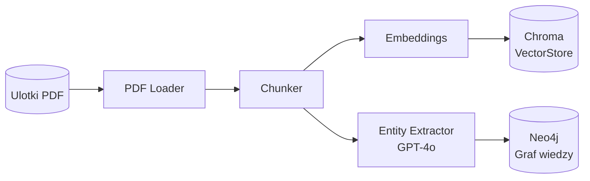
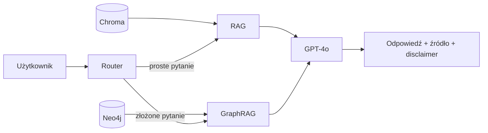
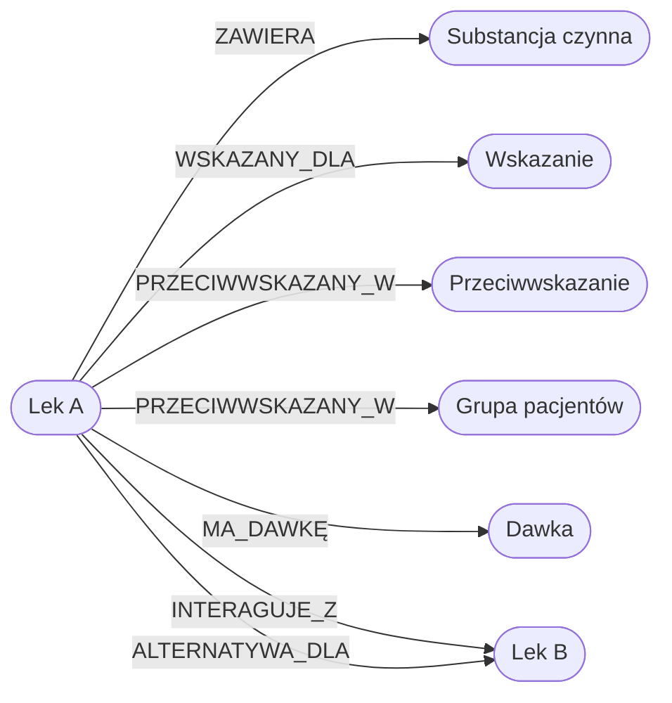
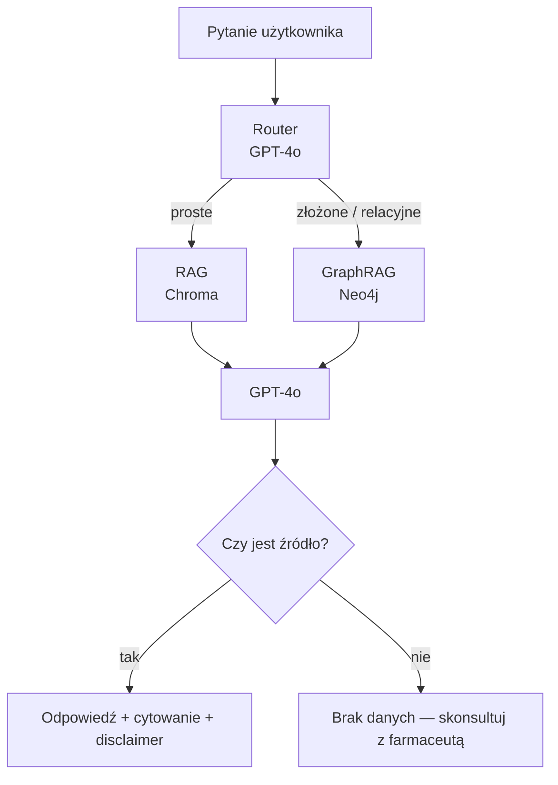

# Dokument Projektowy (PDD - Project Design Document)

Ten dokument opisuje projekt, zakres oraz architekturę techniczną systemu.
Jego celem jest jasne wyjaśnienie **jaki problem system rozwiązuje, jak działa oraz w jaki sposób będzie oceniany**.

Dokument powinien być napisany na tyle jasno, aby osoba **niezaangażowana w projekt mogła zrozumieć system oraz odtworzyć demonstrację**.

---

# 1. Przegląd projektu (Overview)

**MedGraph AI** to chatbot do wyszukiwania informacji o lekach na podstawie ulotek w formacie PDF. Użytkownik zadaje pytanie w języku naturalnym (np. "Czy ibuprofen i warfaryna mogą być stosowane razem?"), a system przeszukuje zaindeksowane dokumenty i zwraca odpowiedź wraz ze wskazaniem źródła.

Głównym celem projektu jest pokazanie przewagi **GraphRAG nad tradycyjnym RAG** — pytania wymagające połączenia kilku faktów (np. lek + interakcja + przeciwwskazanie) są obsługiwane przez graf wiedzy, a nie przez losowe trafienie w fragment tekstu. Projekt jest skierowany do studentów i osób uczących się o GenAI, a jako dane testowe wykorzystuje publicznie dostępne ulotki leków. Technologie: Python, OpenAI API, LangChain, Chroma, Neo4j.

---

# 2. Opis problemu (Problem Statement)

## Problem

Informacje o lekach są zapisane w długich dokumentach PDF (ulotki, charakterystyki produktu). Wyszukanie odpowiedzi na konkretne pytanie wymaga ręcznego przeglądania wielu stron. Tradycyjny RAG radzi sobie z prostymi pytaniami, ale zawodzi gdy odpowiedź wymaga połączenia kilku faktów z różnych miejsc dokumentu — np. dawka + wiek pacjenta + choroba towarzysząca.

## Rozwiązanie

System buduje graf wiedzy z ulotek PDF, gdzie węzły to leki, substancje, wskazania i przeciwwskazania, a krawędzie to relacje między nimi (np. `INTERACTS_WITH`, `CONTRAINDICATED_IN`). Dzięki temu złożone pytania są rozwiązywane przez przejście po grafie, a nie przez wyszukiwanie fragmentów tekstu. Każda odpowiedź zawiera informację o źródle i disclaimer że decyzję podejmuje lekarz/farmaceuta.

---

# 3. Architektura systemu (System Architecture)

**Faza 1 — wczytywanie dokumentów (jednorazowa):**

**Faza 2 — odpowiadanie na pytania:**

## Komponenty systemu

| Komponent | Opis | Technologia |
|---|---|---|
| PDF Loader | Wczytywanie ulotek | LangChain PyPDFLoader |
| Chunker | Podział tekstu na fragmenty | RecursiveCharacterTextSplitter |
| Entity Extractor | Ekstrakcja encji i relacji z tekstu | GPT-4o |
| Vector Store | Przechowywanie embeddingów | Chroma |
| Graf wiedzy | Encje i relacje farmaceutyczne | Neo4j |
| RAG | Wyszukiwanie semantyczne (baseline) | LangChain |
| GraphRAG | Wyszukiwanie przez graf | LangChain + Neo4j |
| Interfejs | Interfejs użytkownika | Streamlit lub CLI |

---

# 4. Projekt systemu AI (AI System Design)

## LLM

- **Model**: GPT-4o przez OpenAI API
- **Zastosowanie**: ekstrakcja encji z ulotek, odpowiadanie na pytania na podstawie pobranego kontekstu

## System wyszukiwania wiedzy (Retrieval)

- **RAG**: fragmenty ulotek zaindeksowane w Chroma, wyszukiwanie po podobieństwie semantycznym
- **Model embeddingów**: `text-embedding-3-small`
- **Chunking**: ~500 tokenów, overlap 100

## Graf wiedzy

- **Baza**: Neo4j (lokalnie)
- **Węzły**: Lek, Substancja czynna, Wskazanie, Przeciwwskazanie, Działanie niepożądane, Dawka, Grupa pacjentów
- **Relacje**: `ZAWIERA`, `WSKAZANY_DLA`, `PRZECIWWSKAZANY_W`, `INTERAGUJE_Z`, `ALTERNATYWA_DLA`

## Workflow systemu

---

# 5. Źródła danych (Data Sources)

| Źródło | Format | Cel | Przetwarzanie |
|---|---|---|---|
| Ulotki dla pacjenta (PIL) | PDF | Dawkowanie, przeciwwskazania, działania niepożądane | Chunking + embeddingi + ekstrakcja encji |
| Charakterystyki produktu (SmPC) | PDF | Szczegółowe dane kliniczne | Chunking + embeddingi + ekstrakcja encji |

Każdy dokument ma zapisane metadane: nazwa leku, typ dokumentu, numer strony — żeby można było cytować źródło w odpowiedzi.

---

# 6. User Stories

**US-01: Zapytanie o dawkowanie**
Jako użytkownik
Chcę zapytać o dawkę leku dla dziecka o podanym wieku i wadze
Aby uzyskać informację bez ręcznego przeszukiwania ulotki

Acceptance Criteria:
- system zwraca dawkę z podaniem dokumentu źródłowego i strony
- odpowiedź zawiera disclaimer o konieczności konsultacji z lekarzem

---

**US-02: Sprawdzenie interakcji**
Jako użytkownik
Chcę sprawdzić czy dwa leki można stosować jednocześnie
Aby uniknąć niebezpiecznych interakcji

Acceptance Criteria:
- system sprawdza relację między lekami w grafie wiedzy
- jeśli interakcja istnieje — opisuje ryzyko i podaje źródło
- jeśli brak danych — informuje o tym wprost

---

**US-03: Leki przeciwwskazane w ciąży**
Jako użytkownik
Chcę uzyskać listę leków przeciwwskazanych w ciąży
Aby szybko sprawdzić bezpieczeństwo stosowanych leków

Acceptance Criteria:
- system zwraca listę leków z zaindeksowanych dokumentów
- każda pozycja ma cytowanie
- odpowiedź zaznacza, że lista dotyczy tylko zaindeksowanych dokumentów

---

**US-04: Wyszukanie zamiennika**
Jako użytkownik
Chcę znaleźć alternatywę dla danego leku z tym samym składnikiem aktywnym
Aby móc zapytać lekarza o zamiennik

Acceptance Criteria:
- system zwraca leki z relacją ALTERNATYWA_DLA lub tym samym składnikiem aktywnym
- odpowiedź informuje że zamiana wymaga konsultacji

---

**US-05: Porównanie RAG i GraphRAG**
Jako użytkownik
Chcę zobaczyć jak różnią się odpowiedzi RAG i GraphRAG na to samo pytanie
Aby zrozumieć kiedy GraphRAG daje lepsze wyniki

Acceptance Criteria:
- oba systemy odpowiadają na ten sam zestaw pytań
- wyniki są zestawione obok siebie
- widać, że GraphRAG lepiej radzi sobie z pytaniami wieloetapowymi

---

**US-06: Brak danych — uczciwa odmowa**
Jako użytkownik
Chcę żeby system powiedział wprost, gdy nie ma danych o danym leku
Aby nie polegać na wymyślonej odpowiedzi

Acceptance Criteria:
- system nie generuje odpowiedzi z "pamięci" modelu gdy brak danych w dokumentach
- komunikat jest jednoznaczny i sugeruje konsultację ze specjalistą

---

# 7. Scenariusze użycia (Use Cases)

**UC-01: Dawkowanie pediatryczne**

Aktor: Użytkownik (rodzic lub farmaceuta)

Opis: Użytkownik pyta o dawkę ibuprofenu dla 8-letniego dziecka ważącego 30 kg.

Kroki:
1. Użytkownik wpisuje pytanie: "Jaka jest dawka ibuprofenu dla dziecka 8 lat, 30 kg?"
2. Router rozpoznaje pytanie jako złożone (wiek + waga + lek)
3. GraphRAG pobiera regułę dawkowania z grafu
4. LLM generuje odpowiedź z dawką, cytowaniem i disclaimerem

---

**UC-02: Sprawdzenie interakcji**

Aktor: Użytkownik (pacjent lub lekarz)

Opis: Użytkownik pyta czy warfarynę można stosować z aspiryną.

Kroki:
1. Użytkownik wpisuje: "Czy warfaryna i aspiryna mogą być stosowane razem?"
2. GraphRAG sprawdza krawędź INTERAGUJE_Z między oboma lekami w Neo4j
3. LLM odpowiada z opisem ryzyka i cytowaniem źródła

---

**UC-03: Zamiennik leku**

Aktor: Użytkownik (pacjent)

Opis: Użytkownik pyta o zamiennik diklofenaku.

Kroki:
1. Użytkownik wpisuje: "Czym można zastąpić diklofenak?"
2. GraphRAG szuka leków z relacją ALTERNATYWA_DLA lub tym samym składnikiem aktywnym
3. System zwraca listę z cytowaniami i informacją o konieczności konsultacji

---

**UC-04: Pytanie o nieznany lek**

Aktor: Użytkownik

Opis: Użytkownik pyta o lek, którego nie ma w zaindeksowanych dokumentach.

Kroki:
1. Użytkownik wpisuje pytanie o lek spoza kolekcji
2. System nie znajduje danych ani w Chroma, ani w Neo4j
3. System odpowiada: "Brak danych w dostępnych dokumentach. Skonsultuj się z farmaceutą."

---

**UC-05: Porównanie RAG vs GraphRAG**

Aktor: Użytkownik

Opis: Użytkownik zadaje złożone pytanie i widzi odpowiedzi obu systemów.

Kroki:
1. Użytkownik pyta: "Które leki przeciwbólowe są bezpieczne przy chorobie wrzodowej żołądka?"
2. RAG zwraca losowe fragmenty tekstu bez spójnej odpowiedzi
3. GraphRAG łączy wskazania z działaniami niepożądanymi i zwraca strukturalną odpowiedź
4. Użytkownik widzi różnicę w jakości obu podejść

---

# 8. Scenariusze ewaluacji (Evaluation Scenarios)

**E-01: Proste pytanie o wskazania**

Wejście: "Na co stosuje się ibuprofen?"

Oczekiwane zachowanie: system zwraca wskazania z ulotki z cytowaniem dokumentu

Kryterium sukcesu: odpowiedź jest zgodna z ulotką, zawiera cytowanie

---

**E-02: Interakcja lek-lek**

Wejście: "Czy warfaryna i aspiryna mogą być stosowane razem?"

Oczekiwane zachowanie: GraphRAG identyfikuje interakcję w grafie i opisuje ryzyko

Kryterium sukcesu: GraphRAG odpowiada poprawnie; RAG baseline radzi sobie gorzej lub nie trafia w odpowiedni fragment

---

**E-03: Pytanie wieloetapowe (multi-hop)**

Wejście: "Które leki przeciwbólowe są bezpieczne dla pacjenta z chorobą wrzodową żołądka?"

Oczekiwane zachowanie: GraphRAG łączy wskazania bólowe z efektami żołądkowymi i dzieli leki na bezpieczne i niezalecane

Kryterium sukcesu: odpowiedź zawiera dwie kategorie leków z uzasadnieniem; RAG nie radzi sobie z tym pytaniem

---

**E-04: Brak danych**

Wejście: pytanie o lek nieobecny w kolekcji

Oczekiwane zachowanie: system odmawia odpowiedzi i sugeruje konsultację

Kryterium sukcesu: brak wymyślonych informacji w odpowiedzi

---

**E-05: Leki przeciwwskazane w ciąży**

Wejście: "Które leki są przeciwwskazane w ciąży?"

Oczekiwane zachowanie: GraphRAG przeszukuje węzły PatientGroup(ciąża) i zwraca listę leków z cytowaniami

Kryterium sukcesu: lista zawiera co najmniej 3 leki z cytowaniami; odpowiedź zaznacza że dane dotyczą tylko zaindeksowanych dokumentów

---

# 9. Ograniczenia systemu (Limitations)

**Jakość ekstrakcji encji**
LLM może niepoprawnie wyekstrahować encje lub relacje z PDF — szczególnie z tabel i list. Wpływ: niekompletny lub błędny graf, gorsza jakość odpowiedzi GraphRAG.

**Halucynacje LLM**
Model może wyjść poza kontekst i dodać informacje spoza dokumentów. Mitygacja: prompt instruuje model żeby odpowiadał tylko na podstawie dostarczonego kontekstu.

**Niepełna kolekcja dokumentów**
System zna tylko zaindeksowane ulotki. Pytania o leki spoza kolekcji zawsze kończą się odmową. Jest to świadome ograniczenie — projekt nie zastępuje pełnej bazy leków.

**Jakość skanowanych PDF**
Słabej jakości skany mogą dać błędny tekst. W takich przypadkach wyniki są nieprzewidywalne.

---

# 10. Plan demonstracji (Demo Plan)

## Przygotowanie

1. Ustaw klucz `OPENAI_API_KEY` w pliku `.env`
2. Uruchom Neo4j lokalnie (`docker run -p 7474:7474 -p 7687:7687 neo4j`)
3. Uruchom ingestion: `python ingest.py` (wczytuje PDF-y, buduje Chroma i Neo4j)
4. Uruchom aplikację: `streamlit run app.py`

## Przebieg demonstracji

**Krok 1** — pokaż graf wiedzy w Neo4j Browser: węzły leków i relacje między nimi

**Krok 2** — zadaj proste pytanie (np. "Na co stosuje się paracetamol?") — pokaż że RAG poprawnie odpowiada z cytowaniem

**Krok 3** — zadaj pytanie o interakcję (np. "Czy warfaryna i aspiryna mogą być razem?") — pokaż że GraphRAG trafia w relację w grafie, a RAG może nie znaleźć odpowiedzi

**Krok 4** — zadaj pytanie wieloetapowe (np. "Który lek przeciwbólowy jest bezpieczny przy chorobie wrzodowej?") — pokaż że GraphRAG łączy fakty, RAG nie radzi sobie

**Krok 5** — zapytaj o lek spoza kolekcji — pokaż uczciwy komunikat o braku danych

**Krok 6** — pokaż tabelę porównawczą RAG vs GraphRAG na kilku pytaniach
