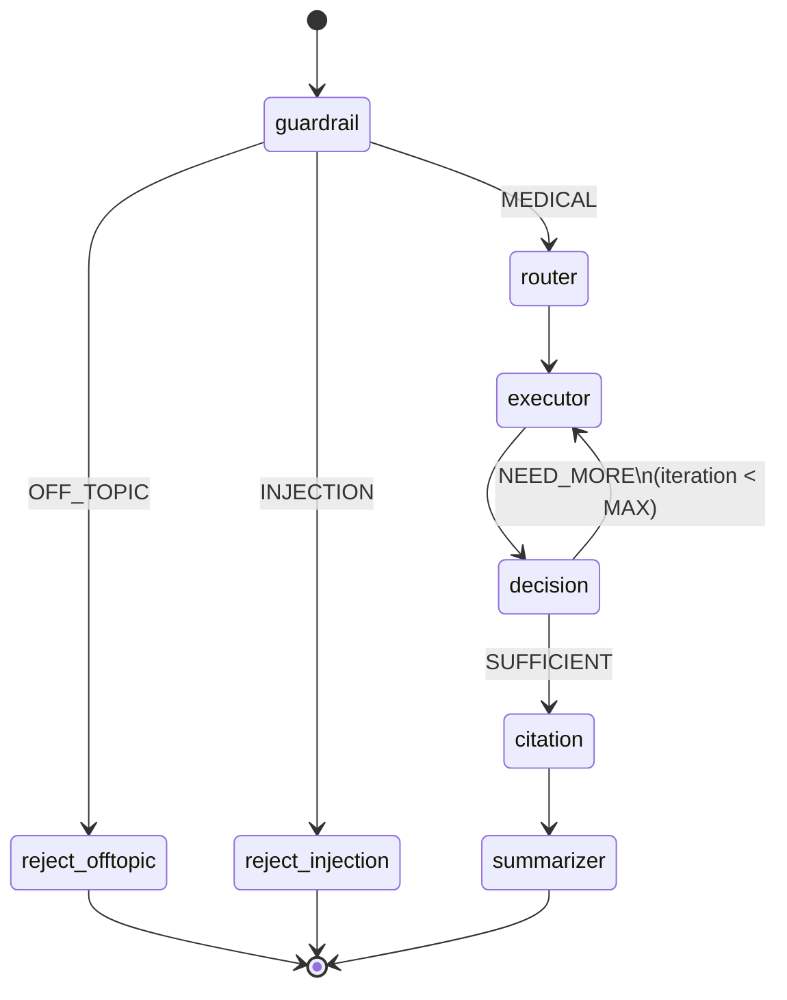
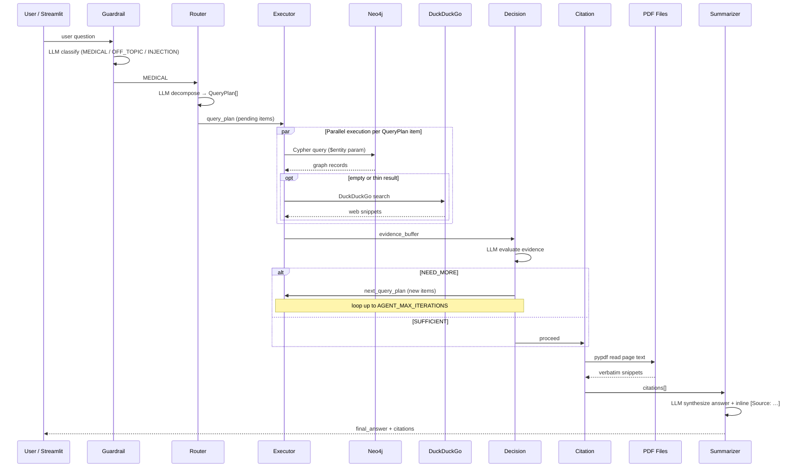
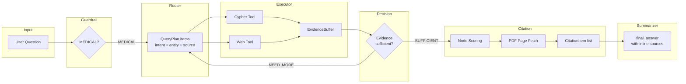
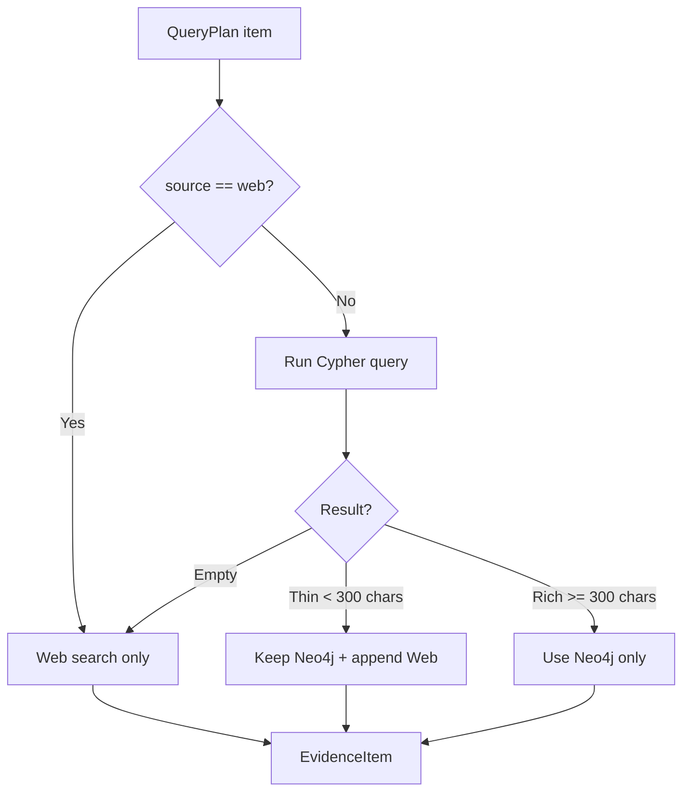
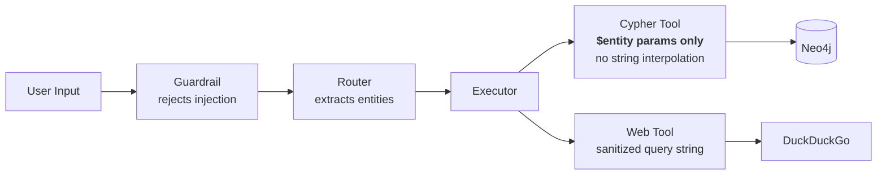

# Agent Pipeline — High-Level Overview

## Purpose

Answer natural language pharmaceutical questions using a stateful LangGraph multi-agent pipeline. The pipeline replaces the legacy single-pass RAG approach with iterative, parallel evidence gathering, deterministic citation building, and grounded answer synthesis.

## Pipeline Flow

```
user input
  │
  ▼
[guardrail]       Classify: MEDICAL / OFF_TOPIC / INJECTION (single LLM call)
  │
  ├─ OFF_TOPIC  ──► reject_offtopic  ──► END
  ├─ INJECTION  ──► reject_injection ──► END
  │
  ▼
[router]          Decompose question into QueryPlan items (intent + entity per fact needed)
  │
  ▼
[executor]        Run all pending items in parallel:
  │                 → try Neo4j Cypher first
  │                 → fall back to DuckDuckGo web search if empty
  ▼
[decision]        LLM evaluates evidence: SUFFICIENT or NEED_MORE
  │
  ├─ NEED_MORE  ──► [executor]  (loop — hard cap: AGENT_MAX_ITERATIONS)
  │
  ▼
[citation]        Deterministic: score node_names, fetch verbatim PDF page text
  │
  ▼
[summarizer]      Synthesize grounded answer with inline [Source: …] citations
  │
  ▼
  END             final_answer + citations returned to app
```

## State Machine Diagram



## Sequence Diagram — Single Query Turn



## Data Flow Through AgentState



## Multi-Agent Coordination Detail

The pipeline is a **LangGraph StateGraph** where each node acts as a specialized agent with a single responsibility. Coordination happens through shared `AgentState` — a TypedDict that flows through every node. There is no direct inter-node messaging; all communication is via state fields that LangGraph merges after each node returns.

### Node Roles and LLM Usage

| Node | Role | LLM Calls | Key Input Fields | Key Output Fields |
|------|------|-----------|-----------------|-------------------|
| **guardrail** | Input safety classifier | 1 (temp=0) | `messages` | `guardrail_label` |
| **router** | Question decomposer | 1 (temp=0) | `messages`, `session_context` | `query_plan`, resets `evidence_buffer`/`iteration` |
| **executor** | Parallel evidence gatherer | 0 | `query_plan` (pending items) | `evidence_buffer`, `iteration` |
| **decision** | Evidence sufficiency evaluator | 0–1 (temp=0) | `evidence_buffer`, `query_plan`, `iteration` | `llm_decision`, `next_query_plan` |
| **citation** | Deterministic citation builder | 0 | `evidence_buffer`, `query_plan` | `citations`, possibly `error` |
| **summarizer** | Grounded answer synthesizer | 0–1 (temp=0) | `citations`, `error` | `final_answer`, `messages`, `session_context` |

### Iteration Loop

The executor↔decision loop is the pipeline's self-correction mechanism:

1. **Executor** runs all `pending` QueryPlan items via `asyncio.gather` (true parallelism)
2. **Decision** evaluates whether evidence covers the original question
3. If `NEED_MORE`, decision emits new `QueryPlan` items (different entity/intent combos or `source: "web"` fallbacks) and routes back to executor
4. Hard cap at `AGENT_MAX_ITERATIONS` (default 20) prevents infinite loops
5. If decision's `NEED_MORE` response is unparseable, it defaults to `SUFFICIENT`

Anti-loop safeguards in the decision prompt:
- Never re-query a `query_id` that already has good evidence
- Never query the same `(entity, intent)` pair more than twice
- Never add queries for facts outside the original question

### Session Continuity

`MemorySaver` (LangGraph checkpointer) persists `session_context` across turns using `thread_id`. This enables:
- **Pronoun resolution**: "What are its side effects?" → router reads `current_drug` from previous turn
- **Indication tracking**: `current_indication` carries forward for follow-up questions
- **Turn counting**: `turn_count` incremented by summarizer each turn

### Executor Fallback Strategy



### Security Boundaries



User input never reaches Neo4j as raw text. The guardrail blocks prompt injection attempts, and all Cypher queries use `$entity` / `$secondary_entity` as Neo4j parameters — user strings are never interpolated into query text.

## Key Properties

| Property | Detail |
|----------|--------|
| **Async** | All nodes are `async def`; `asyncio.gather` runs executor items in parallel |
| **Stateful** | `AgentState` TypedDict flows through every node; `MemorySaver` persists session context across turns |
| **Iterative** | Decision node can loop the executor up to `AGENT_MAX_ITERATIONS` times |
| **Grounded** | Citation node fetches verbatim text from actual PDF pages via `pypdf` — no LLM hallucination in citations |
| **Safe** | Guardrail rejects off-topic and injection attempts before any graph query is executed |
| **Injection-safe** | All Cypher queries use `$entity` / `$secondary_entity` parameters — user input never interpolated into query text |

## Module Map

```
agent/
  graph.py          Build + compile the LangGraph StateGraph
  state.py          AgentState, QueryPlan, EvidenceItem, CitationItem TypedDicts
  memory.py         MemorySaver checkpointer (session context per thread_id)
  nodes/
    guardrail.py    Input classifier
    router.py       Query plan decomposer
    executor.py     Parallel Cypher + web search runner
    decision.py     SUFFICIENT / NEED_MORE evaluator
    citation.py     Deterministic citation builder
    summarizer.py   Final answer synthesizer
  tools/
    cypher_tool.py  8 parameterised Cypher templates
    web_tool.py     DuckDuckGo fallback search
```

## Detailed Documentation

- [State Schema](./agent-state.md)
- [Nodes](./agent-nodes.md)
- [Tools: Cypher + Web Search](./agent-tools.md)
