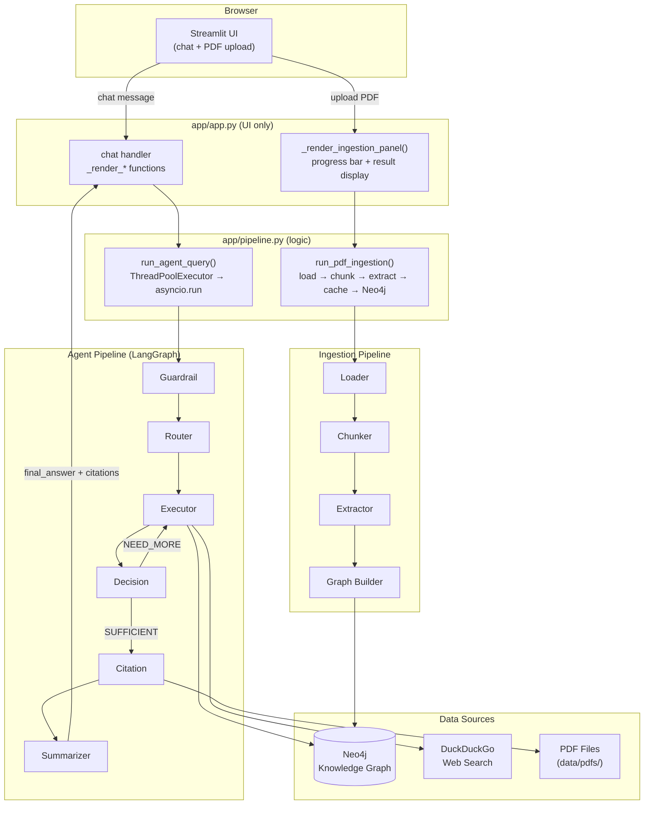

# Streamlit App

**Files:** `app/app.py` · `app/pipeline.py`

The app layer has two responsibilities, split across two files:

| File | Role |
|------|------|
| `app/app.py` | Streamlit UI — chat, PDF upload, rendering, session state |
| `app/pipeline.py` | Pipeline logic — agent query execution, PDF ingestion |

`app.py` imports `run_agent_query` and `run_pdf_ingestion` from `pipeline.py` and calls them; all business logic lives in `pipeline.py`.

---

## Architecture



## Running

```bash
# Via Docker (recommended)
docker compose up neo4j app -d

# Locally (requires Neo4j running)
uv run streamlit run app/app.py

# Access at
http://localhost:8501
```

---

## `app/pipeline.py`

Contains all pipeline logic. No Streamlit imports.

### `run_agent_query(user_input, session_id) → dict`

Invokes the LangGraph agent pipeline and returns:

```python
{
    "answer":    str,          # final synthesised answer
    "citations": list[dict],   # CitationItem list from the citation node
    "no_data":   bool,         # True if no answer was generated
    "trace":     list[dict],   # raw [{node_name, updates}] per node execution
}
```

Wraps `graph.astream(...)` in `asyncio.run()` inside a `ThreadPoolExecutor` thread because Streamlit's script thread may already have a running event loop — calling `asyncio.run()` directly would raise `RuntimeError: This event loop is already running`.

`app.py` formats the raw `trace` list into display-ready dicts via `_format_node_trace` before storing it in `st.session_state["agent_trace"]`.

### `run_pdf_ingestion(pdf_path, progress=None) → dict`

Runs the full PDF ingestion pipeline (load → chunk → extract → cache → Neo4j) for a single file.

```python
{
    "pages":           int,
    "chunks":          int,
    "extractions":     int,
    "entity_types":    dict[str, list[str]],   # type → deduplicated names
    "cache_total":     int,                    # total records in extractions.json after merge
    "nodes":           int,
    "relations":       int,
    "failed":          int,
    "neo4j_breakdown": list[dict],             # per-label node counts from verify query
    "error":           str | None,             # "no_pages" | "no_chunks" | None
}
```

**`progress` dict** — optional mutable `{"completed": 0, "total": 0}`. The pipeline sets `total` after chunking and increments `completed` per extracted chunk. `app.py` polls this dict from the main thread to drive a live extraction progress bar while the pipeline runs in a `ThreadPoolExecutor` thread.

**Cache behaviour** — `_append_to_extraction_cache` (private to `pipeline.py`) loads the existing `data/processed/extractions.json`, appends new records, and writes back. Non-destructive: previous extractions from other PDFs are preserved.

---

## `app/app.py`

UI rendering only. All functions are either `_render_*` or helpers that call `st.*`.

### Path Setup

Both `app.py` and `pipeline.py` insert the project root and `app/` directory into `sys.path` at module load using `os.path.abspath(__file__)`. This ensures `agent/`, `shared/`, `graph/`, and `ingestion/` imports resolve correctly whether run locally or inside Docker (where the working directory is `/app`).

### UI Layout

**Chat mode (default)**

- **Sidebar** — session info and **📤 Add New PDF** upload section
- **Chat area** — conversation history via `st.chat_message`
- **Sources expander** — citations per assistant message (intent, verbatim, PDF/web links)
- **Agent trace expander** — visible only when `?debug=1` is in the URL

**Ingestion mode**

When `ingestion_active` is set in session state the chat area is replaced by the ingestion panel. The sidebar remains visible.

### PDF Upload & Ingestion

`_render_upload_sidebar()` renders a `st.file_uploader` accepting `.pdf` files.
Clicking **🚀 Ingest PDF**:

0. Saves uploaded bytes to `data/pdfs/<filename>`
0. Sets `ingestion_active = True` in session state
0. Calls `st.rerun()` to switch to ingestion panel

`_render_ingestion_panel()` is pure UI: it creates a `progress` dict, submits `run_pdf_ingestion` to a `ThreadPoolExecutor`, and polls `progress` every 0.4 s to update two progress bars:

| Progress element | What it tracks |
|------------------|----------------|
| Overall `st.progress` bar | Advances proportionally to extraction progress (15–75%), jumps to 100% when done |
| Per-chunk `st.progress` bar | Updates from `progress["completed"] / progress["total"]` |

After the future completes, the function renders stage results (pages, chunks, entity breakdown, Neo4j stats) from the returned dict.

### Agent Trace Rendering

`_format_node_trace(node_name, updates) → dict` converts a raw `{node_name, updates}` pair into a display-ready dict with a human-readable `summary` string and flattened fields per node type.

`_render_agent_trace(trace, container)` renders the formatted trace into any Streamlit container (main area or sidebar) using expanders, one per node step.

### Session State

**Chat state**

| Key | Type | Description |
|-----|------|-------------|
| `session_id` | `str` (UUID) | Thread ID for LangGraph `MemorySaver` |
| `messages` | `list` | Displayed conversation history |
| `agent_trace` | `list[dict]` | Formatted trace from last `run_agent_query` call |

**Ingestion state**

| Key | Type | Description |
|-----|------|-------------|
| `ingestion_active` | `bool` | When `True`, ingestion panel replaces chat UI |
| `ingestion_pdf_path` | `Path` | Absolute path to the saved PDF |
| `ingestion_filename` | `str` | Original upload filename |
| `ingestion_done` | `bool` | Set after pipeline completes; prevents re-run on rerender |
| `ingestion_result` | `dict` | Full result dict from `run_pdf_ingestion` |

### Debug Panel (`?debug=1`)

Activate by appending `?debug=1` to the URL. Renders `_render_memory_panel()` in the sidebar:

- **Session Context** — JSON from the LangGraph `MemorySaver` checkpointer
- **Message History** — each turn expandable with full content
- **Last Run — Agent Trace** — per-node expandable sections

The agent trace is also shown inline below the assistant message in the chat area.

---

## Static PDF Serving

`_sync_static_pdfs()` mirrors `data/pdfs/` → `app/static/pdfs/` on startup and after each in-app ingestion. Files are copied only when size or mtime differs. Streamlit serves them at `/app/static/pdfs/<filename>` with `#page=N` anchors for citation links.

---

## Safety Display

All assistant responses include the medical disclaimer appended by `summarizer_node`:

> ⚠️ This information is provided for reference only. Always consult a doctor or pharmacist before making any medication decision.

Citation sources are shown in a collapsible expander, labelled by intent (e.g. "contraindication", "dose") and marked with source type (PDF or web).
