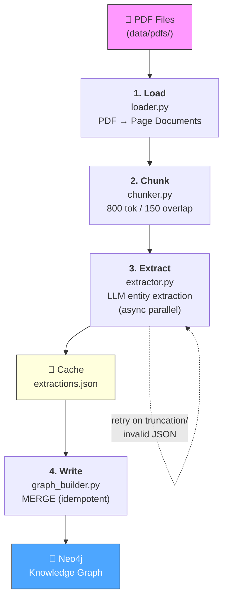
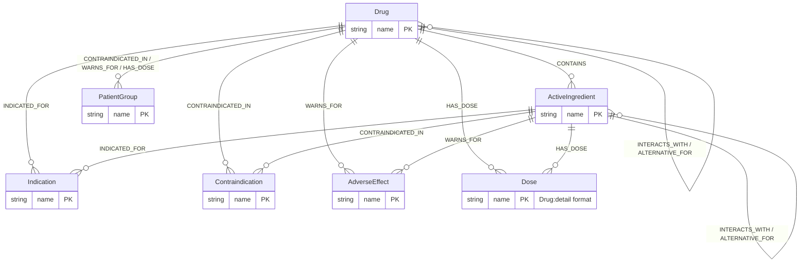

# Ingestion Pipeline — High-Level Overview

## Purpose

Convert pharmaceutical PDFs into a queryable Neo4j knowledge graph. The pipeline extracts clinical entities (drugs, doses, indications, etc.) and their relationships using an LLM, then writes them idempotently into Neo4j.

## Stages

```
data/pdfs/
    │
    ▼
[1. LOAD]      loader.py        PDF pages → LangChain Documents
    │
    ▼
[2. CHUNK]     chunker.py       Pages → overlapping token-bounded chunks
    │
    ▼
[3. EXTRACT]   extractor.py     Chunks → entities + relations (LLM, parallel)
    │
    ▼
data/processed/extractions.json   (cache — skip LLM on re-runs)
    │
    ▼
[4. WRITE]     graph_builder.py  Extractions → Neo4j MERGE (idempotent)
    │
    ▼
Neo4j database
```

### Pipeline Flow Diagram



## Orchestration

`ingest.py` runs stages 1–3 and writes the JSON cache.
`seed.py` runs stage 4, loading cached extractions into Neo4j.
`graph/schema.py` sets up constraints/indexes (run once before seeding).

**In-app ingestion** — the Streamlit app (`app/app.py`) exposes a sidebar PDF uploader that triggers all four stages inline for a single uploaded file. New extractions are *appended* to the existing cache rather than overwriting it, so previously processed PDFs are unaffected.

## What Goes In / What Comes Out

| Stage | Input | Output |
|-------|-------|--------|
| Load | PDF files | Page-level Documents with metadata |
| Chunk | Page Documents | Chunk Documents (800 tok, 150 overlap) |
| Extract | Chunk Documents | Dicts: `{text, metadata, entities, relations}` |
| Write | Extraction dicts | Neo4j nodes + relationships |

## Key Design Decisions

- **Cache layer** — `extractions.json` separates expensive LLM calls from graph writes; re-runs skip LLM.
- **Idempotent writes** — all Neo4j operations use `MERGE`; pipeline is safe to re-run.
- **Section-aware extraction** — chunks are annotated with section type (dose, indication, etc.) before LLM call; a hint is injected into the prompt to focus extraction.
- **Parallel extraction** — chunks extracted concurrently via `asyncio.gather` + `asyncio.Semaphore` (default: min(20, N) concurrent requests; override with `EXTRACTION_MAX_WORKERS`).
- **Citations propagated end-to-end** — `source_file` + `page_number` travel from PDF → chunk → extraction → Neo4j relationship property → UI.

## Graph Schema

**Nodes**

| Label | Description |
|-------|-------------|
| `Drug` | Medication product (INN generic name) |
| `ActiveIngredient` | Pharmacologically active chemical |
| `Indication` | Condition the drug treats |
| `Contraindication` | Condition making the drug unsafe |
| `AdverseEffect` | Unwanted side-effect |
| `Dose` | Dosing instruction — format: `"Drug:detail"` |
| `PatientGroup` | Patient population with special considerations |

Clinical concept nodes (`Indication`, `Contraindication`, `AdverseEffect`, `Dose`, `PatientGroup`) also carry the `:ClinicalConcept` base label to enable schema-agnostic queries.

### Entity-Relationship Diagram



**Relationships**

| Type | From | To |
|------|------|----|
| `CONTAINS` | Drug | ActiveIngredient |
| `INDICATED_FOR` | Drug / ActiveIngredient | Indication |
| `CONTRAINDICATED_IN` | Drug / ActiveIngredient | Contraindication / PatientGroup |
| `HAS_DOSE` | Drug / ActiveIngredient | Dose |
| `INTERACTS_WITH` | Drug / ActiveIngredient | Drug / ActiveIngredient |
| `ALTERNATIVE_FOR` | Drug / ActiveIngredient | Drug / ActiveIngredient |
| `WARNS_FOR` | Drug / ActiveIngredient | AdverseEffect / PatientGroup |

## Error Recovery (summary)

- Corrupt PDFs skipped, extraction continues.
- LLM truncated response → chunk split in half, each half re-extracted, results merged.
- Invalid JSON → retry with error feedback.
- Schema-violating relations → LLM correction retry.
- Isolated entities (no relation) not written to graph.

## Detailed Documentation

### Ingestion
- [Stage 1 — Load](./ingestion-stage1-load.md)
- [Stage 2 — Chunk](./ingestion-stage2-chunk.md)
- [Stage 3 — Extract](./ingestion-stage3-extract.md)
- [Stage 4 — Write to Graph](./ingestion-stage4-graph.md)

### Shared Utilities
- [Shared: LLM Client](./shared-llm-client.md)
- [Shared: Neo4j Client](./shared-neo4j-client.md)
- [Shared: Prompts](./shared-prompts.md)

### Agent Pipeline
- [Agent Overview](./agent-overview.md)
- [Agent State Schema](./agent-state.md)
- [Agent Nodes](./agent-nodes.md)
- [Agent Tools](./agent-tools.md)

### Application & Evaluation
- [Streamlit App](./app.md)
- [Evaluation Harness](./evaluation.md)
